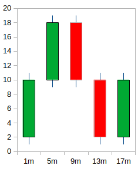
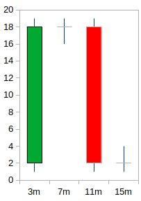
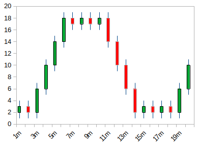

# I Need a Date

## Introduction
I am working on a real-time analysis and automated trading system for [Forex](https://en.wikipedia.org/wiki/Foreign_exchange_market) written in C++. The data received from my broker, [Oanda](https://developer.oanda.com/rest-live-v20/introduction/), constists of [candlestick](https://en.wikipedia.org/wiki/Candlestick_chart) data of varying timeframes (i.e. 5 seconds, 10 minutes, etc.). Oanda calls these same timeframes '[Candlestick Granularity](http://developer.oanda.com/rest-live-v20/instrument-df/)' and offers up 21 different time durations from 5 seconds to 1 month.

When I analyze a candlestick chart, I am looking for patterns in the past that have been known to trigger a reaction when price gets back into that range. I will then enter into a trade, hoping that the same reaction will occur.

Now why is that important and can't I just get the data from the broker, look at it, and see the patterns that interest me? Well, not exactly. Let me give you an example. Let's assume that my strategy has me looking for a group of candlestick patterns on a four minute chart where price only fluctuated by less than one dollar.  Once I find this pattern then I need to pay attention when price is headed back into that area. Here is an example candlestick chart that I am currently analyzing:

That pattern is not present in this chart so I would not have any trading opportunities ... or would I. Lets take a look at the same data but shifted by two minutes:

Now the pattern is present and I would have a trading opportunity.

## Problems

## What is needed

## How to do it

## Notes
Here is the [LibreOffice spreadsheet](./misc/candlestick_conflicting_timeframes.ods) and 1 minute candlestick chart that I used to create the above 4 minute charts: 

