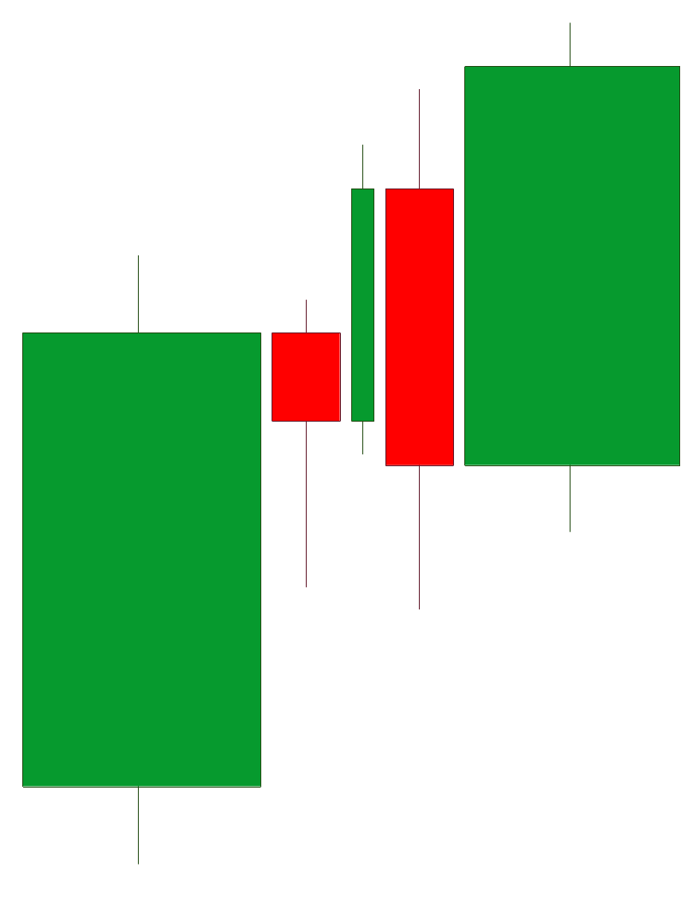

# Introducing a Microservices Based Automated Trading System

I am introducing a microservices based trading system that when complete will monitor Forex Instruments, automatically make trades, as well as provide custom data for determining the quality of a trade. This project has been released on GitHub.

I always wanted to trade stocks but never felt knowledgeable enough to have confidence in trading. I have taken classes to learn the ins and outs of selecting trades but I have learned that my style of thinking doesn’t always fit in a box with what I have been taught. The traditional technique I was taught was to look at a chart of candlesticks, find specific patterns, then watch for price to move back into those areas. If the characteristics of the specific patterns are correct, then price should behave in a statistically expected way.

Now we all know that there are forces outside our control that can affect the movement of stock prices and that sometimes they even seem random, although it is probably people/institutions with more money than you doing their thing.

***

## Scott's Rule #1: *Find a trading technique that can give you 30% success while profiting at 3 times risk.*

Now a lot of successful trading has more to do with risk management than with winning 100% of your trades. So how does this work? Consider for all trades I risk $1X, meaning that if price goes against me for $1X then I will exit the trade and accept my loss. Now, if I structure all my trades so that if price goes my way I will profit $3X. Now I only have to be correct on 3 out of 10 trades (3\*3X - 7\*1X = +2X).

Now for the first hook into why I am writing this software. I want to backtest large amounts of trading data across multiple timeframes looking for specific patterns that meet Rule #1. I want to use statistics and eventually machine learning to help find these patterns. I want better control over how the data is organized and combined so that it gives me the answers I need as quick as possible.

***

## Scott's Rule #2: *Focus on ways to decrease your loss, not increase your win.*

Once a basic trading technique has been selected (primary patterns), it is time to find reactionary patterns in the data. These reactionary patterns may show up before, during, or after important points in the primary pattern. If the success of the reactionary pattern can be quantified then either including or excluding it will decrease your loss rate.

Finding these reactionary patterns requires a lot of analysis/reanalysis while tweaking constants. This is another reason why I am working on my trading software. I want control of all the data so that I can perform as much research as necessary (including machine learning in the future) to find these patterns.

***

## Scott's Rule #3: *Candlestick timeframes are based on a manmade construct.*

The problem with candlestick timeframes is that changing the start time for the candlesticks can affect the structure/patterns seen in the data. Which candlestick pattern is from the correct perspective? None of them really.

I believe there is a better way to analyze the data by letting the data define the candlesticks instead of time defining the candlesticks. The candlesticks need to allow for a variable width that matches the actual time that the data is rising (uptrend), staying steady (sideways), or lowering (downtrend). At this point, it becomes more of a series of mathematical equations based on a set of constants that define what a candlestick chart will look like. Because of this there needs to be a lot of analysis to determine what defines an uptrend, sideways, and downtrend so that a proper candlestick chart can be displayed.

***

## Scott's Rule #4: *Think outside the box with what the data is telling you.*

The current candlestick chart gives very little information (open, high, low, close) and how data flows over time. The typical way to show other data (indicators) is by including a bar chart, line chart, or other way to display the data in relation to the graph.

I want to use a modified bar chart that can include multiple data sets (bar charts, etc.) related to the entire range of prices at that time point. This can include data such as average velocity during the candlestick, time spent at that price, or a multitude of other types of data. I believe that showing data in this format will start to group data in horizontal bands that can be significant to making trading decisions.
 

The second type of chart I want to use shows the high and low at each time with a line graph but will also display important data in horizontal bands continuing across the chart. This will show data that reoccurs or is pertinent to specific prices and highlight important levels over time.
 

These new chart types will require large amounts of data. Yet another reason to be in charge of the data and it’s format to make it display as fast as possible.

***

# The Libraries

My trading system is made up of three public projects and one private project. The private project contains algorithms and techniques to which I have access but because of patent and other legalities I can’t publish online. Your first question will be "What is with the Offcenter?" It is a historical name that I have used for decades.

| Library | Description |
|:--------|:------------|
| [offcenter_common](https://github.com/CodeRancher/offcenter_common) | A set of C++ libraries of support classes and routines for other offcenter applications and libraries. [Documentation](https://coderancher.github.io/offcenter_common/index.html) |
| [offcenter_trading](https://github.com/CodeRancher/offcenter_trading) | A set of C++ applications and libraries that implement a microservices based trading system. [Documentation](https://coderancher.github.io/offcenter_trading/index.html) |
| [offcenter_oanda](https://github.com/CodeRancher/offcenter_oanda) | A C++ library that provides access to the OANDA v20 REST API. [Documentation](https://coderancher.github.io/offcenter_oanda/index.html) |

*All projects licensed:* [Apache License, Version 2.0](https://www.apache.org/licenses/LICENSE-2.0)

## Why Release It

This project is still in an early stage but I wanted to release it into the world for several reasons.

Find like-minded people who might be interested in joining me.
Allow possible employers to see what I can do.

***

## offcenter_common

The offcenter_common project is a set of libraries containing support classes and routines for other offcenter applications and libraries.

***

### amqp

Simplifies connecting to and using an ActiveMQ server. This is a framework to create producers and consumers, automatically receive messages, and simplify configuration of connections to the server. It also simplifies marshaling/unmarshaling data that is sent over ActiveMQ.
[Example](https://github.com/CodeRancher/offcenter_common/tree/main/lib/amqp/example)

***

### amqp_server

Simplified application framework that will create a connection to the ActiveMQ server, accept configuration options from the command line or file, and process messages. The general idea is to create a class inherited from IAmqpServerApp, then override several methods where processing of messages can occur.
[Example](https://github.com/CodeRancher/offcenter_common/tree/main/lib/amqp_server/example)

***

### common

Common classes used across other libraries. Global exceptions, command line simulator for unit tests, common date-time handling, and others.

***

### framework

#### admin

Libraries to administrate distributed systems via AMQP. Will allow nodes to be started, stopped, paused, and resumed.

Not fully implemented.

#### application

A framework for a repeatable way to create applications that handle command line and config file options. It simply allows other frameworks to be stacked, each with their own set of options. It also simplifies creating different application managers to handle different initialization and shutdown strategies for other technologies such as AMQP, REST Servers, or Dear ImGui applications.

#### program_options

Basic shared program options that can be used across all frameworks.

***

### imgui

Application framework based on the above framework to simplify initialization of a Dear ImGui application.
[Example](https://github.com/CodeRancher/offcenter_common/tree/main/lib/imgui/example)

***

### program_options

Basic classes for handling program options and their related configuration classes.
[Example](https://github.com/CodeRancher/offcenter_common/tree/main/lib/program_options/example)

***

### rest_server

Supporting code to create a REST Server by simply adding handlers for specific REST paths.
[Example](https://github.com/CodeRancher/offcenter_common/tree/main/lib/rest_server/example)

***

### schedule

Supporting code to run scheduled and timed tasks.

Not fully implemented.

***

### soci

Shared code to manage connections to and access a MySQL database using soci.
[Example](https://github.com/CodeRancher/offcenter_common/tree/main/lib/soci/example)

***

### threading

Supporting code to simplify threading. Simply create a class that overrides 'task' and then 'start' the reoccurring task. Can also manage an array of 'tasks'.
[Example](https://github.com/CodeRancher/offcenter_common/tree/main/lib/threading/example)

## offcenter_trading

### Libraries

***

#### common

Common exceptions, logging, and miscellaneous utilities.

***

#### data_types

Data types passed around the trading system.
[Example](https://github.com/CodeRancher/offcenter_trading/tree/main/lib/data_types/example)

***

#### data_types_amqp

AMQP conversion routines for data_types as they are sent and received over ActiveMQ.

***

#### data_types_json

JSON conversion routines for data_types as they are marshaled and unmarshaled.

***

#### data_types_soci

SOCI conversion routines for data_types as they are persisted and read from the database.

***

#### db

SQL for creating, reading, and updating a trading database. Most of this code is from a previous iteration of the software but can be used for reference.

***

#### imgui_cmake

A cmake project that can build Dear ImGui. The recommended way to use Dear ImGui is to include the source in each project. This allows the Dear ImGui to be built as a library and included in a cmake project.

***

#### oanda_persistence_client

Classes and utilities to read, write, and update the trading database. This is related to Oanda and and non-Oanda trading data.

***

#### trading

The classes and utilities for calculating trading data and indicators. This is where the bulk of analysis and trading calculations occur.

***

#### trading_db

Classes used to create the trading database, both Oanda and non-Oanda.

### Applications

***

#### admin_manager

An application that will manage all nodes of the trading system. Allow them to be started, stopped, and paused. Will also display the current state of all nodes.

Not currently implemented.

***

#### create_trading_db

Create the trading database. Connects to the MySQL server and then creates the database, needed tables, then populates the lookup tables with required data.

***

#### generate_sine_candlesticks

When completed, it will generate simulated candlestick values (open, high, low, close) for bid and ask over a given time range using a specific timeframe. This will allow parts of the microservices framework to be tested with a stream of data that is 'close' to reality.

***

#### oanda_manager_simulation

Not currently implemented.

This application will read data from the CSV file generated by the persist_oanda_forex_data_to_csv application and send it to the rest of the system. It is intended for development and system testing.

***

#### oanda_persistence_manager

A REST server that gives access to the Trading Database (both Oanda and generic trading data). The generic trading data is what is required to make trading decisions for a security, bond, or an trading instrument.

***

#### persist_oanda_candle_data

A server that will read data from Oanda for one or more instruments and place it into the oanda_persistence_manager. It will first read all the historical data (in blocks) that is available and then begin reading real-time data. It will then signal to the rest of the system that data is ready to be processed.

***

#### persist_oanda_forex_data_to_csv

Not implemented.

An application that will download a range of data from Oanda for a specific instrument to a CSV file. The intention is to read data from this CSV file instead of directly from Oanda and push it through the entire system. That way Oanda isn't unhappy with hitting their servers more than is necessary.

***

#### process_candlestick_hierarchy

A server that will receive the current candlestick record to process and expand it into other timeframes. The overall design of this part of the system is to only download 5 second candlesticks from the Oanda server, then generate the 10 second, 15 second, 30 second, etc. and save this data into the database. It will also generate the proprietary candlesticks (variable time) that will be used in custom analysis.

***

#### signal_current_candle

This server will monitor when new instrument data is added to the system and when available, it will send that data through the rest of the system. The idea for this server is that it doesn't care if the data is historical or real-time, it will just send the data through the rest of the system.

***

#### signal_current_candle_trigger

This is an application that will simulate when new data is available for processing by the system. It is for development and system testing.

***

## offcenter_oanda

A C++ library that provides access to the [OANDA v20 REST API](https://developer.oanda.com/rest-live-v20/introduction/).
